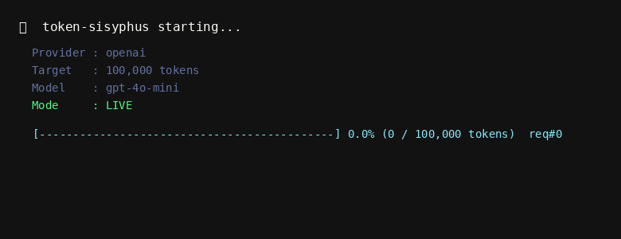

<div align="center">
  
  <h1>🪨 token-sisyphus</h1>
  <p><em>Your company built a leaderboard for AI token usage.<br>Congratulations — you are now Sisyphus, and the boulder is a chatbot.</em></p>

  <p>
    <a href="docs/README.zh.md">中文</a> •
    <a href="docs/README.ja.md">日本語</a> •
    <a href="docs/README.ko.md">한국어</a> •
    <a href="docs/README.fr.md">Français</a> •
    <a href="docs/README.es.md">Español</a>
  </p>

  
  
  
  
  
  <a href="https://clawhub.ai/skills/token-sisyphus"></a>
</div>

---



## Why does this exist?

Many companies now track employee AI usage as a productivity KPI.  
"Top token users" get recognition. "Low token users" get questioned.

This tool burns LLM tokens on your behalf — so you can top the company AI usage chart without actually doing anything.

You're welcome.

## Features

- 🎯 Burn toward a target token count (e.g. `100k`, `1m`)
- 🔌 Supports **OpenAI, Claude, Gemini**, and any OpenAI-compatible API
- 📊 Real-time progress bar with request counter
- ⚙️ Configurable model, delay, max tokens per request
- 🧪 Dry-run mode for testing without real API calls
- 🧩 Skill files for Claude Code, Codex, Gemini CLI, OpenCode, OpenClaw

## Quick Start

```bash
# OpenAI
pip install openai
export OPENAI_API_KEY=sk-...
python burn.py --target 100k

# Claude
pip install anthropic
export ANTHROPIC_API_KEY=sk-ant-...
python burn.py --target 100k --provider claude

# Gemini
pip install google-generativeai
export GEMINI_API_KEY=...
python burn.py --target 100k --provider gemini
```

## Usage

```
python burn.py --target <amount> [options]

  --target       Token count to burn: 50000, 100k, 1m  (required)
  --provider     openai | claude | gemini  (default: openai)
  --model        Model name (provider default used if omitted)
  --api-key      API key (falls back to env var)
  --base-url     Custom base URL (openai provider only)
  --max-tokens   Max tokens per request (default: 500)
  --delay        Seconds between requests (default: 0.5)
  --dry-run      Simulate without real API calls
```

## Examples

```bash
# OpenAI GPT-5.4 (latest)
python burn.py --target 100k --model gpt-5.4

# Claude Sonnet 4.6 (latest)
python burn.py --target 100k --provider claude --model claude-sonnet-4-6

# Gemini 3.1 Pro (latest)
python burn.py --target 100k --provider gemini --model gemini-3.1-pro

# DeepSeek V4 (OpenAI-compatible)
python burn.py --target 500k --base-url https://api.deepseek.com/v1 --model deepseek-v4

# Xiaomi MiMo V2 Pro
python burn.py --target 100k --base-url https://api.xiaomimimo.com/v1 --model mimo-v2-pro

# Dry run (no cost)
python burn.py --target 100k --dry-run
```

## Agent Skills

Use token-sisyphus directly inside your AI coding assistant:

| Platform | File | Install |
|----------|------|---------|
| Claude Code | `skills/claude-code/CLAUDE.md` | Copy to project root |
| OpenAI Codex | `skills/codex/AGENTS.md` | Copy to project root |
| Gemini CLI | `skills/gemini-cli/gemini.md` | Copy to project root |
| OpenCode | `skills/opencode/rules.md` | Copy to project root |
| OpenClaw | `skills/openclaw/SKILL.md` | `clawhub install token-sisyphus` |

**OpenClaw users** can install directly from [ClawHub](https://clawhub.ai/skills/token-sisyphus):

```bash
clawhub install token-sisyphus
```

## Compatible APIs

Any OpenAI-compatible endpoint works out of the box:

| Provider | Recommended model | --base-url |
|----------|-------------------|------------|
| OpenAI | `gpt-5.4` / `gpt-4o-mini` | (default) |
| Anthropic Claude | `claude-sonnet-4-6` | use `--provider claude` |
| Google Gemini | `gemini-3.1-pro` / `gemini-2.5-flash` | use `--provider gemini` |
| DeepSeek | `deepseek-v4` / `deepseek-chat` | `https://api.deepseek.com/v1` |
| Xiaomi MiMo | `mimo-v2-pro` / `mimo-v2-flash` | `https://api.xiaomimimo.com/v1` |
| Qwen / Tongyi | `qwen-turbo` / `qwen-plus` | `https://dashscope.aliyuncs.com/compatible-mode/v1` |
| Moonshot / Kimi | `moonshot-v1-8k` | `https://api.moonshot.cn/v1` |
| Zhipu / GLM | `glm-4-flash` | `https://open.bigmodel.cn/api/paas/v4` |
| Azure OpenAI | your deployed model | your Azure endpoint |
| vLLM / Ollama | any local model | your self-hosted endpoint |

## Output

```
🪨  token-sisyphus starting...
    Provider : openai
    Target   : 100,000 tokens
    Model    : gpt-5.4
    Mode     : LIVE

  [████████████████████░░░░░░░░░░░░░░░░░░░░] 50.3% (50,312 / 100,000 tokens)  req#87

✅  Done.
    Total tokens burned : 100,412
    Requests made       : 174
    Time elapsed        : 91.3s
    Avg tokens/req      : 577

    Your boulder has reached the top. See you tomorrow.
```

## Disclaimer

> This project is a **satirical commentary** on corporate AI productivity metrics.  
> It is intended for educational and entertainment purposes only.  
> The authors do not encourage misuse of AI services, violation of company policies, or waste of computational resources.  
> Use responsibly. If your company is tracking token usage as a KPI, perhaps the real boulder was the meetings we had along the way.

## License

MIT License

Copyright (c) 2026 neardws and token-sisyphus contributors

Permission is hereby granted, free of charge, to any person obtaining a copy
of this software and associated documentation files (the "Software"), to deal
in the Software without restriction, including without limitation the rights
to use, copy, modify, merge, publish, distribute, sublicense, and/or sell
copies of the Software, and to permit persons to whom the Software is
furnished to do so, subject to the following conditions:

The above copyright notice and this permission notice shall be included in all
copies or substantial portions of the Software.

THE SOFTWARE IS PROVIDED "AS IS", WITHOUT WARRANTY OF ANY KIND, EXPRESS OR
IMPLIED, INCLUDING BUT NOT LIMITED TO THE WARRANTIES OF MERCHANTABILITY,
FITNESS FOR A PARTICULAR PURPOSE AND NONINFRINGEMENT. IN NO EVENT SHALL THE
AUTHORS OR COPYRIGHT HOLDERS BE LIABLE FOR ANY CLAIM, DAMAGES OR OTHER
LIABILITY, WHETHER IN AN ACTION OF CONTRACT, TORT OR OTHERWISE, ARISING FROM,
OUT OF OR IN CONNECTION WITH THE SOFTWARE OR THE USE OR OTHER DEALINGS IN THE
SOFTWARE.
