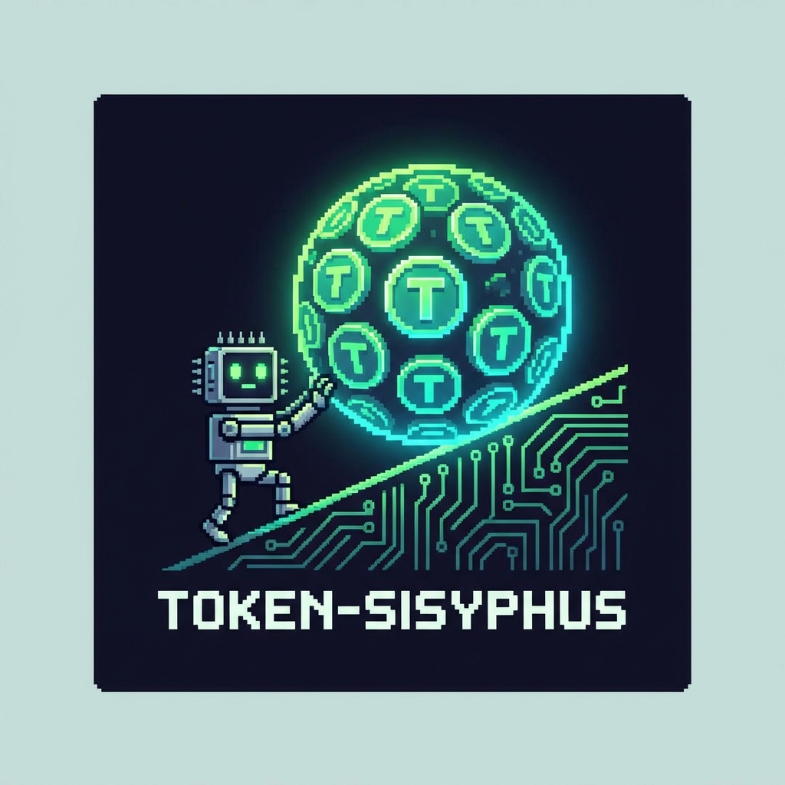

<div align="center">
  
  <h1>🪨 token-sisyphus</h1>
  <p><em>公司做了一个 AI Token 使用排行榜。<br>恭喜你——你现在是西西弗斯，那块巨石是一个聊天机器人。</em></p>

  <p>
    <a href="../README.md">English</a> •
    <a href="README.ja.md">日本語</a> •
    <a href="README.ko.md">한국어</a> •
    <a href="README.fr.md">Français</a> •
    <a href="README.es.md">Español</a>
  </p>

  
  
  
</div>

---

## 为什么会有这个工具？

很多公司开始把"AI 使用量"作为员工 KPI 指标。  
Token 用得多的人受到表扬，用得少的人被质疑工作态度。

这个工具帮你自动消耗 Token，让你轻松登上公司 AI 使用排行榜——哪怕你什么都没做。

不客气。

## 功能特性

- 🎯 按目标 Token 数量消耗（如 `100k`、`1m`）
- 🔌 支持 **OpenAI、Claude、Gemini** 及所有 OpenAI 兼容接口
- 📊 实时进度条 + 请求计数
- ⚙️ 可配置模型、请求间隔、单次最大 Token 数
- 🧪 Dry-run 模式，不发真实请求
- 🧩 支持 Claude Code、Codex、Gemini CLI、OpenCode、OpenClaw 的 Skill 文件

## 快速开始

```bash
# OpenAI
pip install openai
export OPENAI_API_KEY=sk-...
python burn.py --target 100k

# Claude
pip install anthropic
export ANTHROPIC_API_KEY=sk-ant-...
python burn.py --target 100k --provider claude

# Gemini
pip install google-generativeai
export GEMINI_API_KEY=...
python burn.py --target 100k --provider gemini
```

## 使用方式

```
python burn.py --target <数量> [选项]

  --target       目标 Token 数：50000、100k、1m（必填）
  --provider     openai | claude | gemini（默认：openai）
  --model        模型名称（省略则使用各 provider 默认值）
  --api-key      API Key（或设置对应环境变量）
  --base-url     自定义 API 地址（仅 openai provider）
  --max-tokens   每次请求最大 Token 数（默认：500）
  --delay        请求间隔秒数（默认：0.5）
  --dry-run      模拟模式，不发真实请求
```

## 使用示例

```bash
# OpenAI GPT-4o-mini（默认）
python burn.py --target 100k

# Claude Haiku
python burn.py --target 100k --provider claude --model claude-3-haiku-20240307

# Gemini Flash
python burn.py --target 100k --provider gemini --model gemini-1.5-flash

# 使用 DeepSeek API
python burn.py --target 500k --base-url https://api.deepseek.com/v1 --model deepseek-chat

# 使用通义千问
python burn.py --target 200k --base-url https://dashscope.aliyuncs.com/compatible-mode/v1 --model qwen-turbo

# 测试模式（不发真实请求）
python burn.py --target 100k --dry-run
```

## 兼容的 API

| 服务商 | provider | --base-url |
|--------|----------|------------|
| OpenAI | `openai` | （默认） |
| Anthropic Claude | `claude` | — |
| Google Gemini | `gemini` | — |
| DeepSeek | `openai` | `https://api.deepseek.com/v1` |
| 通义千问 | `openai` | `https://dashscope.aliyuncs.com/compatible-mode/v1` |
| Moonshot / Kimi | `openai` | `https://api.moonshot.cn/v1` |
| 智谱 / GLM | `openai` | `https://open.bigmodel.cn/api/paas/v4` |
| Azure OpenAI | `openai` | 你的 Azure 地址 |
| vLLM / Ollama | `openai` | 你的自托管地址 |

## Agent Skill 集成

在 AI 编程助手里直接触发，复制对应文件到项目根目录即可：

| 平台 | 文件 |
|------|------|
| Claude Code | `skills/claude-code/CLAUDE.md` |
| OpenAI Codex | `skills/codex/AGENTS.md` |
| Gemini CLI | `skills/gemini-cli/gemini.md` |
| OpenCode | `skills/opencode/rules.md` |
| OpenClaw | `skills/openclaw/SKILL.md` |

## 免责声明

> 本项目是对企业 AI 使用 KPI 考核机制的**讽刺性评论**，仅供娱乐和学习目的。  
> 作者不鼓励滥用 AI 服务、违反公司政策或浪费算力资源。  
> 请合理使用。如果你的公司真的在用 Token 数量衡量工作成效——也许问题不在于 Token 本身。

## 许可证

MIT © 2025 token-sisyphus contributors
